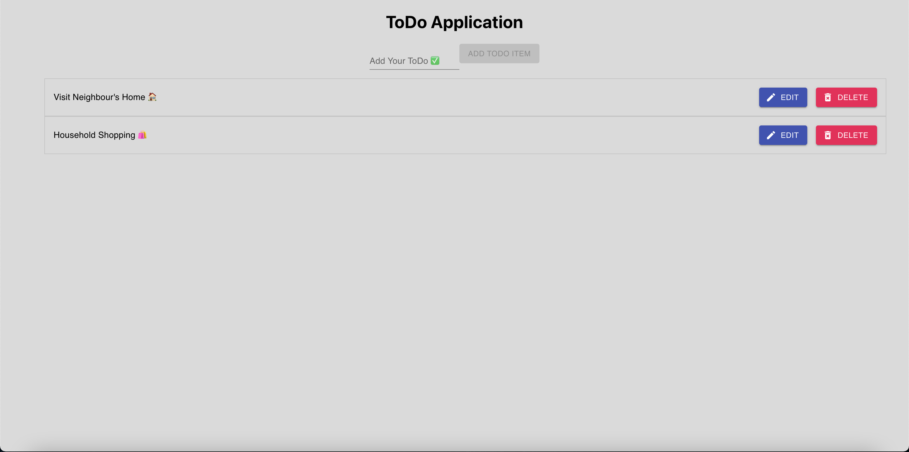

# ToDo Application Management System
A ToDo Application Management System that is mainly used for tracking ToDo Task Items. Any users can view current existing tasks. Users can also be able to add a new task item, edit an existing task item and delete an existing task item.

URL: https://todo-tasks-65a81.web.app/

## Technology Used
HTML5, CSS3, Material UI Design, Javascript (ReactJS Library Framework)

## Web Server
Firebase

## Database
Firebase

## Deployment
Firebase

## Author
Jeet Z. H. Khondker - Full Stack Web Developer
